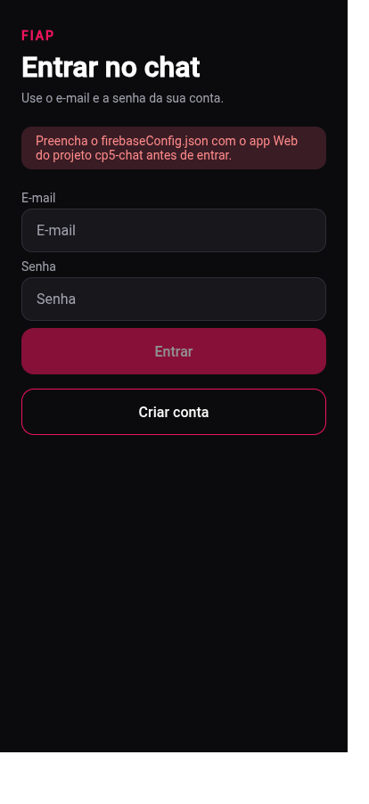
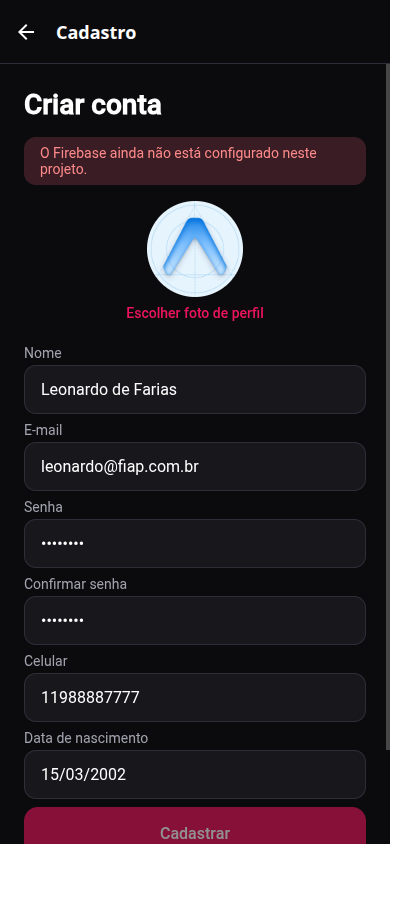
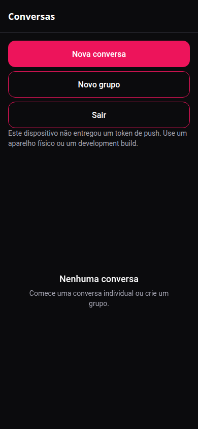
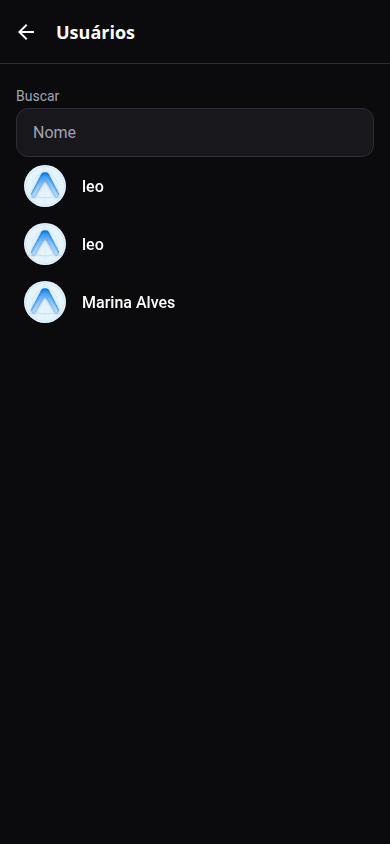
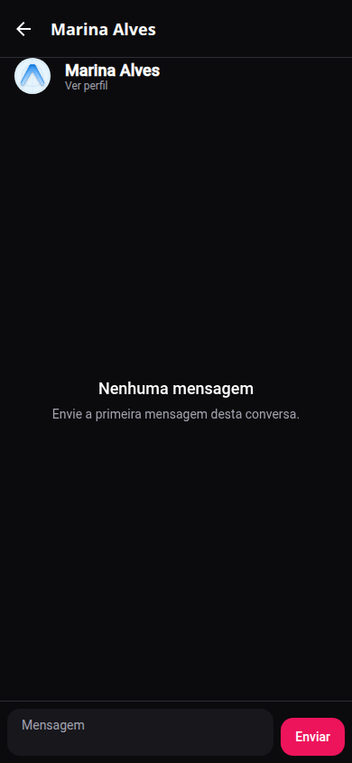
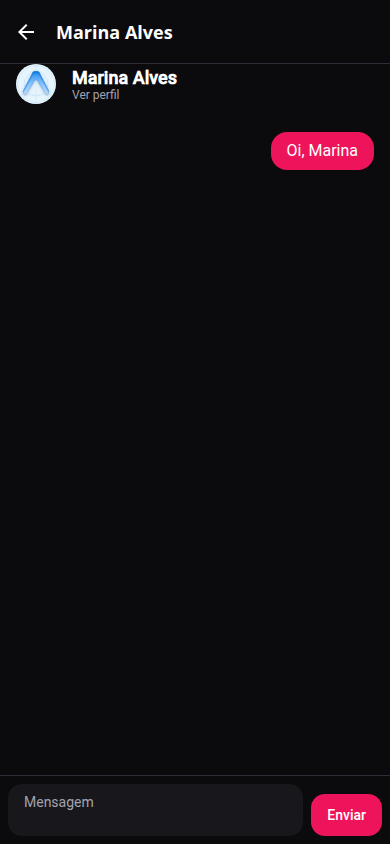
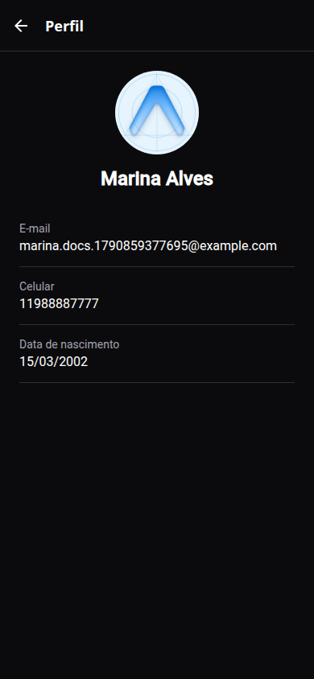
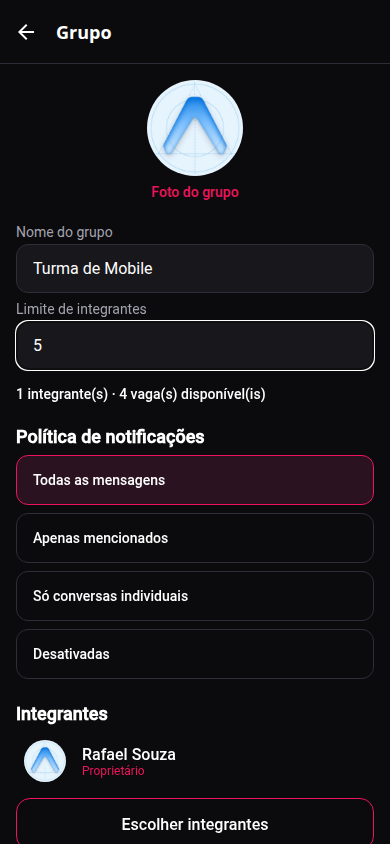
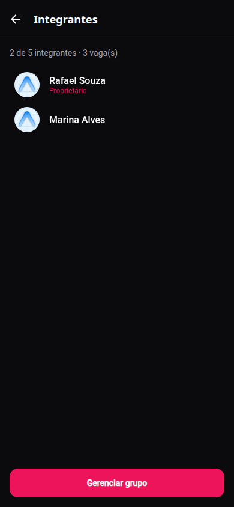
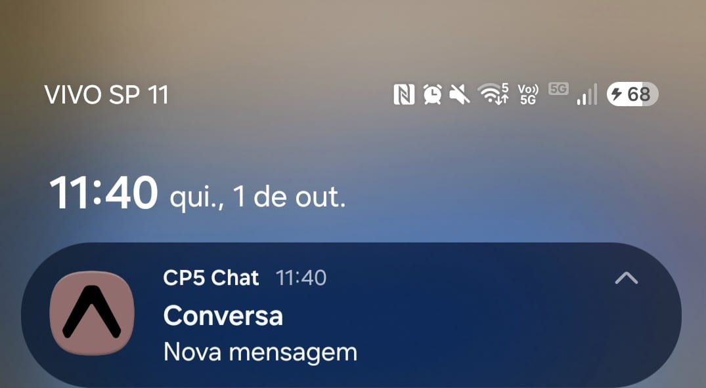

# CP5 Chat

Aplicativo de chat individual e em grupo para Android e iOS, feito com React Native, Expo e TypeScript. Usuários entram só com e-mail e senha. As mensagens ficam no Realtime Database e aparecem na hora. Perfis, grupos, limite de integrantes, política de notificação e tokens de dispositivo ficam no Cloud Firestore. O push sai de uma API separada, nunca do aplicativo.

## Integrantes

- RM555211 — Leonardo de Farias
- RM556603 — Gustavo Laur

## Tecnologias

- React Native
- Expo SDK 57 (`expo` ~57.0.24)
- TypeScript
- React Navigation
- Firebase Authentication, Cloud Firestore, Realtime Database e Cloud Messaging
- Expo Notifications
- API Node.js com Express e Firebase Admin SDK
- Cloudinary para as fotos

## Responsabilidade de cada serviço Firebase

| Serviço | Uso |
| --- | --- |
| Firebase Authentication | Criar conta, entrar, restaurar sessão, identificar pelo `uid` e sair. Só e-mail e senha. |
| Cloud Firestore | Perfil completo, índice público (nome e foto), conversa direta, grupo, integrantes, limite, política de notificação, tokens e trava de entrega do push. |
| Realtime Database | Mensagens e o espelho de quem pode ler cada conversa. |
| Firebase Cloud Messaging | Entrega do push no Android a partir do token nativo, enviada pela API com o Admin SDK. |
| Cloudinary | Arquivo da foto. O Firestore guarda só a URL. |

O Realtime Database não consulta o Firestore. Por isso o acesso à conversa é espelhado em `conversationAccess` e `conversationMeta`. A API é quem cruza os dois bancos: ela relê a mensagem, confere o remetente com o ID token e calcula os destinatários no servidor. O aplicativo não envia a lista de quem deve receber o push.

## Instalação e execução do aplicativo

```bash
cd cp5-chat
npm install
cp .env.example .env
npx expo start
```

Variáveis do aplicativo, sem segredo:

- `EXPO_PUBLIC_API_URL`: URL HTTPS da API publicada
- `EXPO_PUBLIC_EAS_PROJECT_ID`: ID do projeto Expo, usado só para o token da Expo quando o token FCM não estiver disponível

## Configuração do Firebase

O projeto é o [cp5-chat](https://console.firebase.google.com/project/cp5-chat/overview), no plano Spark.

1. Ative Authentication com o provedor e-mail/senha.
2. Crie o Cloud Firestore e o Realtime Database.
3. Em Configurações do projeto, registre um app Web e copie o SDK para [`firebaseConfig.json`](firebaseConfig.json). O arquivo precisa ter `apiKey`, `authDomain`, `databaseURL`, `projectId`, `storageBucket`, `messagingSenderId` e `appId`.
4. Publique as regras:

```bash
npx firebase-tools deploy --only firestore:rules,database --project cp5-chat
```

O `firebaseConfig.json` tem apenas a configuração do SDK cliente do projeto `cp5-chat`. Não coloque conta de serviço, chave privada nem senha nele.

## Fotos

O plano gratuito não permite criar bucket novo do Firebase Storage sem o plano Blaze. As fotos vão para o Cloudinary pela API autenticada. O aplicativo manda o arquivo em `POST /uploads` com o ID token. A API assina o upload com o segredo do Cloudinary e devolve a URL. Só essa URL é gravada no Firestore. Se a foto não existir ou falhar ao carregar, a interface usa a imagem padrão em `assets/icon.png`.

Crie uma conta gratuita no Cloudinary e coloque na hospedagem da API:

- `CLOUDINARY_CLOUD_NAME`
- `CLOUDINARY_API_KEY`
- `CLOUDINARY_API_SECRET`

O aplicativo pede permissão da galeria antes de abrir o seletor. Se a permissão for negada, a tela explica o motivo.

## Notificações no Android e no iOS

O push remoto não funciona só no Expo Go a partir do SDK 53. É preciso um development build.

```bash
npx expo run:android
npx expo run:ios
```

Android:

1. Registre o app Android (`br.com.fiap.cp5chat`) no Firebase.
2. Baixe o `google-services.json` para a raiz do app. Esse arquivo fica de fora do Git.
3. No aparelho ou emulador com Google Play, o app pede a permissão de notificação e grava o token FCM em `users/{uid}/devices/fcm`.

iOS:

1. Ative a capability Push Notifications.
2. Envie a chave APNs no Firebase ou nas credenciais da Expo.
3. O token nativo do iOS é da APNs. Quando não houver token FCM, o app registra o token da Expo e a API entrega pelo Expo Push Service, que usa a APNs.

Ao tocar na notificação, o payload `conversationId` e `conversationType` abre a conversa. O texto da notificação é o nome da conversa e "Nova mensagem", sem o conteúdo da mensagem.

Se a permissão for negada ou o aparelho não gerar token, a lista de conversas explica o estado. As mensagens continuam chegando em tempo real.

## API

Node.js, Express e TypeScript, em [`server/`](server/).

```bash
cd server
npm install
cp .env.example .env
npm start
```

A API local só serve para desenvolvimento. A correção usa a URL pública. Publique, por exemplo, no Render (plano free):

- Build: `npm install`
- Start: `npm start`
- Root directory: `server`

Variáveis secretas, só na hospedagem:

- `FIREBASE_PROJECT_ID`
- `FIREBASE_CLIENT_EMAIL`
- `FIREBASE_PRIVATE_KEY`
- `FIREBASE_DATABASE_URL`
- `CLOUDINARY_CLOUD_NAME`
- `CLOUDINARY_API_KEY`
- `CLOUDINARY_API_SECRET`

A conta de serviço sai de Configurações do projeto, Contas de serviço, com permissão para Auth, Firestore, Realtime Database e Cloud Messaging. Não commite o JSON.

O plano free do Render hiberna. Agende um ping externo em `GET /health` a cada poucos minutos para a instância responder na correção.

### URL pública

`https://cp5-chat-api.onrender.com`

Coloque a mesma URL em `EXPO_PUBLIC_API_URL` no `.env` local do aplicativo. Esse arquivo não entra no Git.

### Endpoints

- `GET /health` — `{ "status": "ok" }`. Não exige login. Use para ver se a API está no ar.
- `POST /notifications/messages` — header `Authorization: Bearer <firebase-id-token>` e corpo `{ "conversationId", "messageId" }`.
- `POST /uploads` — o mesmo header e um campo de formulário `file` com a imagem. Resposta `{ "url" }`.

Conferir a API:

```bash
curl https://cp5-chat-api.onrender.com/health
```

O plano free do Render dorme após 15 minutos sem acesso. A primeira chamada depois disso pode levar cerca de um minuto. Para a API responder na correção, configure um ping externo a cada 10 minutos em `https://cp5-chat-api.onrender.com/health`, por exemplo no [cron-job.org](https://cron-job.org).

Repositório do trabalho: https://github.com/leodefarias/cp5-chat

O `firebaseConfig.json` é a configuração pública do SDK cliente, exigida pelo enunciado. A chave da conta de serviço não está nesse repositório. Se ele estiver privado, o professor precisa de acesso durante a correção.

## Política de notificações

O dono do grupo escolhe a política. A API calcula os destinatários. O remetente nunca entra na lista. Quem não participa também não.

- `all_group_messages`: todos os integrantes, menos quem enviou.
- `mentioned_members`: só quem foi mencionado ou escolhido como destinatário, se ainda for integrante.
- `direct_messages_only`: mensagem de grupo não gera push.
- `disabled`: nada naquele grupo gera push.

Conversa direta sempre notifica a outra pessoa. Uma mesma mensagem não dispara de novo: a API cria `notificationDeliveries/{messageId}`. Se o documento já existe, a chamada repetida não envia outro push. Token inválido desativa o dispositivo.

## Limite do grupo e concorrência

O limite é um inteiro definido na criação, incluindo o dono. A tela mostra quantos integrantes existem e quantas vagas restam, e não deixa reduzir o limite abaixo da quantidade atual.

Isso também vale fora da tela. `addGroupMember` usa `runTransaction` no documento do grupo: a transação relê `memberIds` e só grava se ainda houver vaga. Duas entradas ao mesmo tempo fazem uma confirmar e a outra repetir em cima do dado novo e falhar. As regras do Firestore recusam `memberIds` maior que `memberLimit` e recusam limite menor que a quantidade já gravada. O espelho no Realtime Database só aceita alteração do dono e também recusa contagem acima do limite.

## Regras

- [`firestore.rules`](firestore.rules): só autenticados; perfil completo só do próprio usuário ou de quem tem uma conversa em comum (`peers`); índice público só com nome e foto; devices só do dono; mensagem de grupo só para integrante; só o dono altera o grupo; o limite não estoura; `notificationDeliveries` só pelo Admin SDK.
- [`database.rules.json`](database.rules.json): sem leitura ou escrita aberta. Mensagem só de quem tem acesso, com `senderId` igual ao `uid`, e só na criação. Quem foi removido perde `conversationAccess` e não lê nem envia mensagens novas.

## Estrutura

```text
cp5-chat/
  src/components
  src/screens
  src/services
  src/hooks
  src/contexts
  src/types
  src/utils
  server/src
  firestore.rules
  database.rules.json
  firebaseConfig.json
```

## Prints

As telas do aplicativo foram capturadas no Expo Web. A notificação foi recebida no celular, com development build.





















## Testes

```bash
npm test
npm run typecheck
cd server && npm test && npm run typecheck
```
